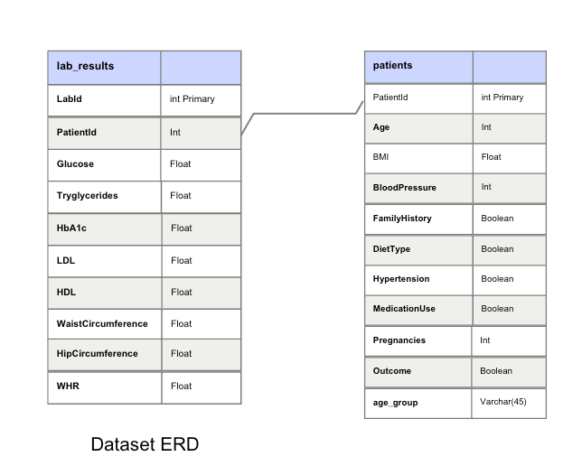
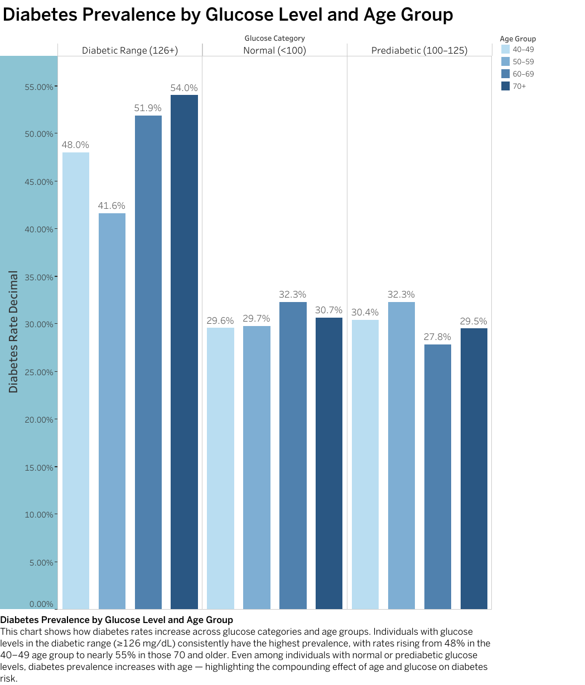
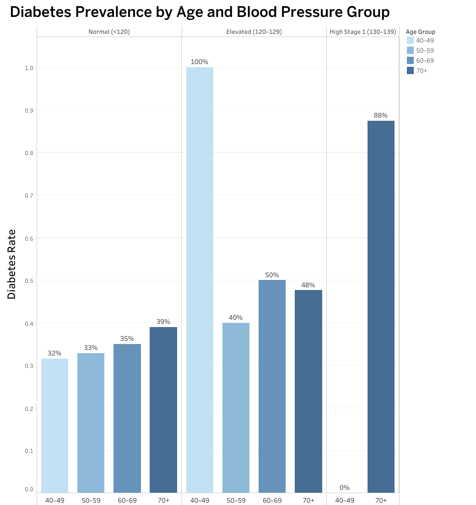
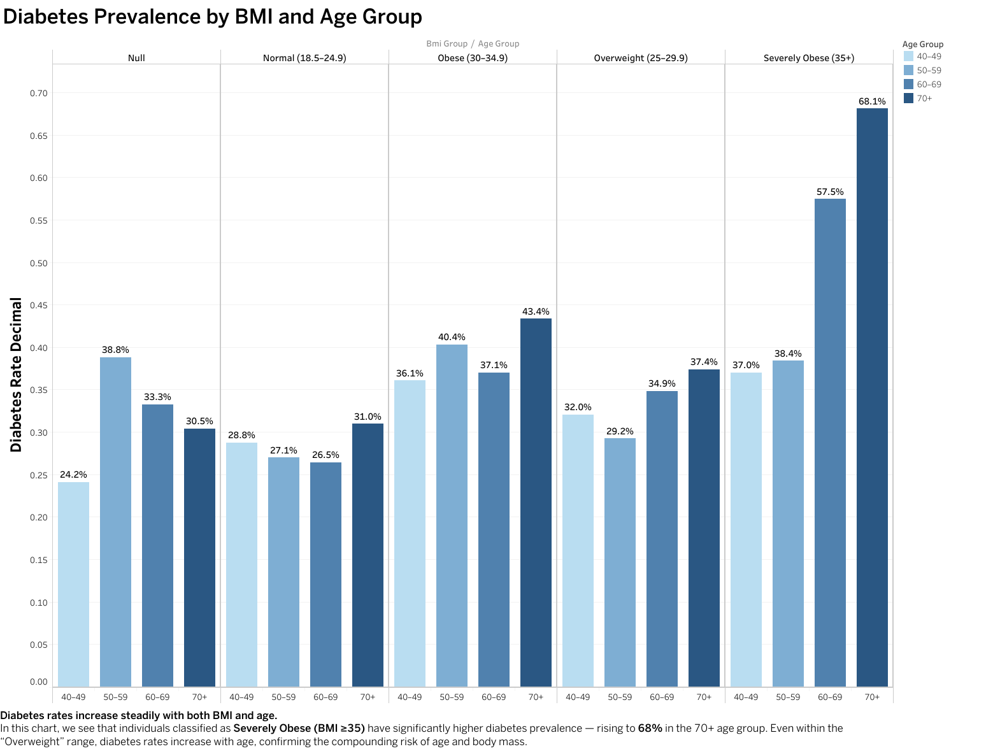
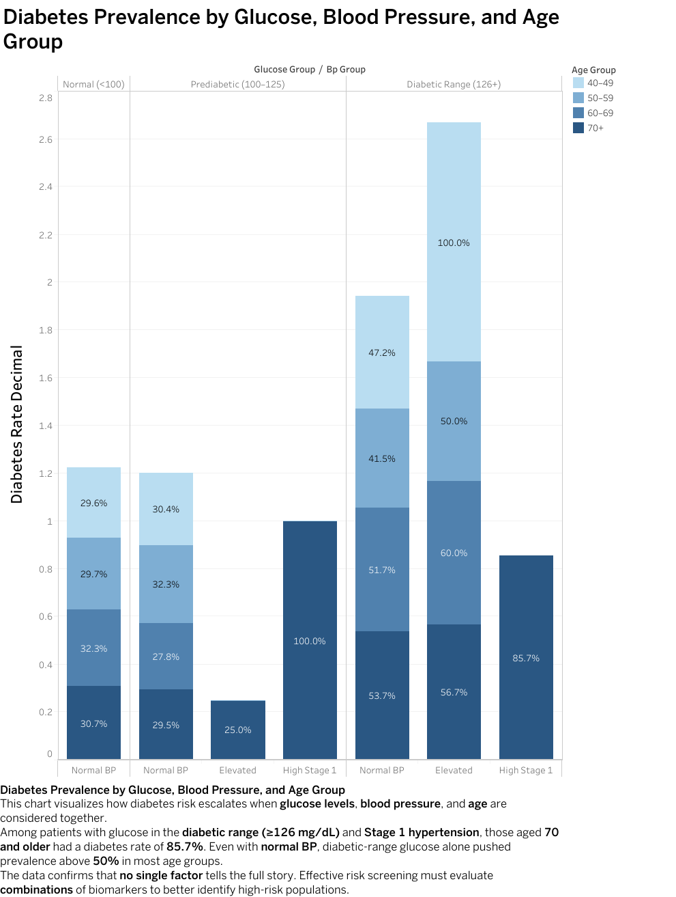

# Understanding Diabetes Risk Through Multi-Factor Analysis

## Executive Summary

This project analyzes anonymized patient health records to identify **biometric and demographic factors most strongly associated with diabetes risk**. Using **SQL for cohort analysis** and **Tableau for visual storytelling**, the study reveals how **glucose, BMI, blood pressure, and age interact to elevate diagnosis likelihood**.

Findings highlight clear **threshold-based risk patterns** and support **targeted screening strategies** that could enable earlier detection, improved preventive care, and more efficient allocation of clinical resources.

---

## Business & Clinical Objective

Healthcare providers and population-health teams require **data-driven methods to identify high-risk patients before diagnosis**.

This analysis was designed to:

* Detect **biometric thresholds** linked to diabetes prevalence
* Quantify **risk escalation across age groups**
* Evaluate **compounding multi-factor risk conditions**
* Provide **actionable screening and intervention guidance**

Primary stakeholders include:

* Preventive care and screening programs
* Population-health analytics teams
* Clinical quality and risk-management leadership

---

## Dataset & Methodology

**Dataset:** Public anonymized diabetes health dataset (~9,500 patients)
**Tools:** SQL, MySQL, Tableau

### Analytical Approach

* Data cleaning and cohort segmentation performed in SQL
* Threshold-based risk factor analysis across biometric indicators
* Comparative diabetes prevalence measurement between patient groups
* Interactive visualization and narrative design developed in Tableau

### Data Model Overview

To support segmented risk analysis and efficient querying, the original
dataset was restructured into two relational tables:

* **patients** — demographic attributes, medical history, and diagnosis outcome
* **lab_results** — biometric measurements including glucose, lipids, and body metrics

This relational structure enables **multi-factor cohort comparison**
across age, BMI, glucose, and blood-pressure indicators.

---

## Key Insights

### 1. Glucose as the Primary Risk Driver

* Diabetes prevalence rises sharply once glucose levels enter the **diabetic range (≥126 mg/dL)**, making glucose the **strongest standalone predictor** of diagnosis across all age groups.

* Within this range, prevalence increases from approximately **48% in adults aged 40–49** to **over 50% among patients aged 70+**, demonstrating that **age compounds metabolic risk even when glucose levels are already elevated**.

* Importantly, the upward age-related trend persists even among individuals with **normal or prediabetic glucose levels**, indicating that **baseline diabetes susceptibility increases with age independent of glucose classification**.

* These findings reinforce glucose testing as the **most critical early screening signal**, while also highlighting the need for **age-adjusted preventive monitoring** in older populations.

---

### 2. Age and Blood Pressure Compound Diabetes Risk

* Diabetes prevalence increases progressively with age, even among individuals with **normal blood pressure**, indicating that aging alone elevates baseline metabolic vulnerability.

* However, the presence of **elevated or Stage-1 hypertension** significantly accelerates this trend. In adults aged **70 and older**, diabetes prevalence rises sharply—reaching levels near **90%** among those with **Stage-1 blood pressure**, representing one of the highest-risk cohorts observed in the analysis.

* These findings demonstrate that **blood pressure acts as a compounding risk factor rather than an isolated predictor**, reinforcing the importance of **age-stratified hypertension monitoring** and **integrated metabolic screening** in older populations.

---

### 3. BMI as a Persistent, Age-Amplified Risk Factor

Diabetes prevalence increases progressively across **BMI categories**, demonstrating a clear dose-response relationship between body mass and metabolic disease risk.

Individuals classified as **Severely Obese (BMI ≥35)** exhibit the highest prevalence across all age groups, with rates approaching **68% among adults aged 70 and older**. This represents one of the strongest standalone risk signals identified in the analysis.

Importantly, elevated BMI raises diabetes likelihood even in **younger populations**, indicating that excess body mass functions as a **long-term metabolic stressor rather than an age-dependent trigger**. As age increases, this baseline risk compounds further, producing sharply higher prevalence in older obese cohorts.

These findings highlight BMI as a **critical preventive-care screening dimension** and support early **weight-management and metabolic monitoring interventions** to reduce long-term diabetes burden.

Risk escalates across glucose and blood-pressure categories even without age segmentation.
---

### 4. Combined Biomarkers Reveal the Highest-Risk Populations

* When glucose level, blood pressure, and age are evaluated together, diabetes prevalence rises dramatically—demonstrating that multi-factor interaction, rather than any single biomarker, drives the most clinically significant risk.

* Among patients with diabetic-range glucose (≥126 mg/dL) and Stage-1 hypertension, adults aged 70 and older exhibit diabetes prevalence approaching 85–90%, representing the highest-risk cohort identified in the analysis. Even in the presence of normal blood pressure, diabetic-range glucose alone pushes prevalence above 50% across most age groups, confirming glucose as the dominant baseline driver while highlighting the amplifying effect of hypertension and aging.

* These findings reinforce the need for integrated risk-screening frameworks that evaluate combinations of metabolic indicators, enabling earlier identification of high-risk patients, more targeted preventive intervention, and improved allocation of clinical resources within population-health programs.

Highest diabetes prevalence occurs in older adults with diabetic glucose and Stage-1 hypertension.  
 

Risk escalates across glucose and blood-pressure categories even without age segmentation.

---

## Recommendations

This analysis supports several **data-driven clinical and population-health strategies** aimed at improving early detection and reducing long-term diabetes burden.

### Targeted Screening & Risk Identification

* Prioritize screening for individuals with **glucose levels exceeding 120 mg/dL**, where diabetes prevalence increases sharply.
* Expand preventive outreach to patients with **BMI ≥30**, particularly within **older age groups**, where metabolic risk compounds significantly.
* Implement **multi-factor risk flagging** that evaluates glucose, BMI, and blood pressure together to identify patients most likely to benefit from early intervention.

### Preventive Resource Allocation

* Focus early-intervention programs on **patients aged 60 and older** presenting **two or more elevated biomarkers**, representing the highest-risk and highest-impact population segment.

### Expected Clinical Impact

Adoption of these strategies could enable:

* **Earlier diagnosis and treatment initiation**
* **Reduction in diabetes-related complications**
* **More efficient allocation of preventive-care resources** across high-risk populations

Together, these actions demonstrate how **integrated biometric analytics** can support **proactive, data-driven population-health management** rather than reactive disease treatment.

---

## Tableau Dashboard

Interactive visualization of cohort segmentation, prevalence trends, and multi-factor risk interaction:

**View Dashboard:**
https://public.tableau.com/app/profile/noemi.vargas7800/viz/UnderstandingDiabetesRisk/DiabetesRiskAnalysis?publish=yes

---

## Technical Assets

* ***01_data*** *- Raw and cleaned datasets used for analysis*
* ***02_SQL_queries*** *- Data cleaning, exploration, and risk analysis SQL*
* ***03_images*** *- Visual outputs used in README storytelling*
* ***04_docs*** *- Technical notes, methodology, assumptions, process*
* ***README.md*** *- Executive case study and business insights*

---

## Assumptions & Limitations

* Dataset is anonymized and simulated for analytical learning
* Cross-sectional snapshot rather than longitudinal tracking
* Certain biomarkers excluded due to data quality constraints

Despite these limitations, the analysis demonstrates **real-world healthcare analytics methodology and decision-support thinking**.

---

## Portfolio Context

This project is part of a broader analytics portfolio demonstrating:

* **Healthcare risk analysis**
* **Business intelligence storytelling**
* **SQL-driven cohort analytics**
* **Actionable decision support**

