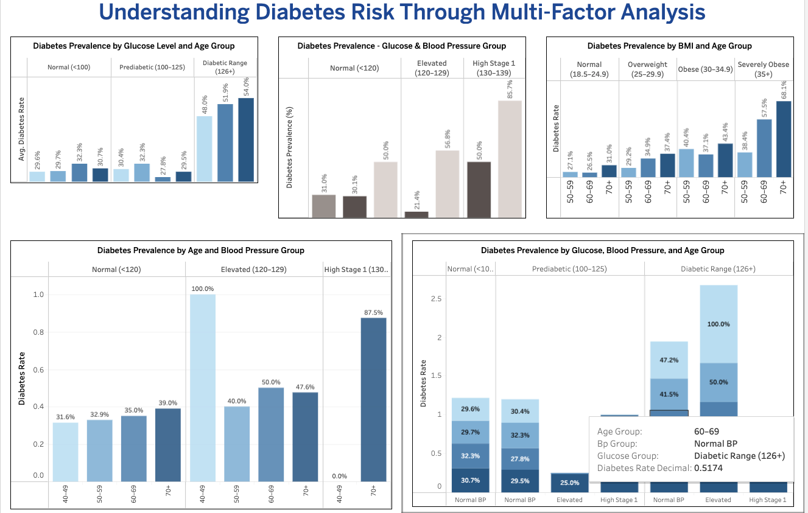
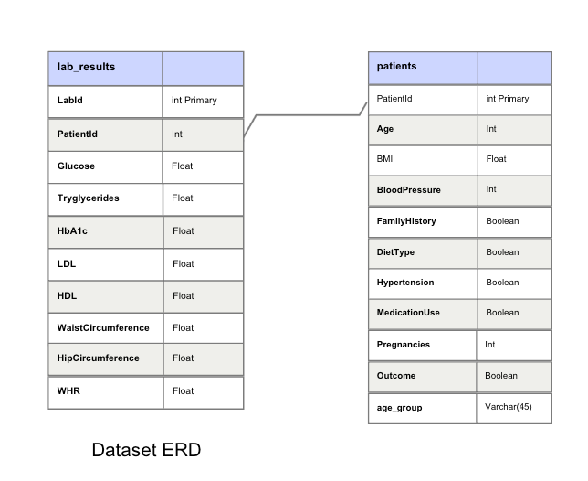
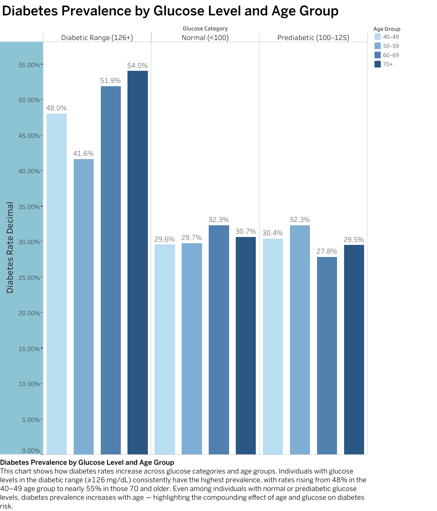
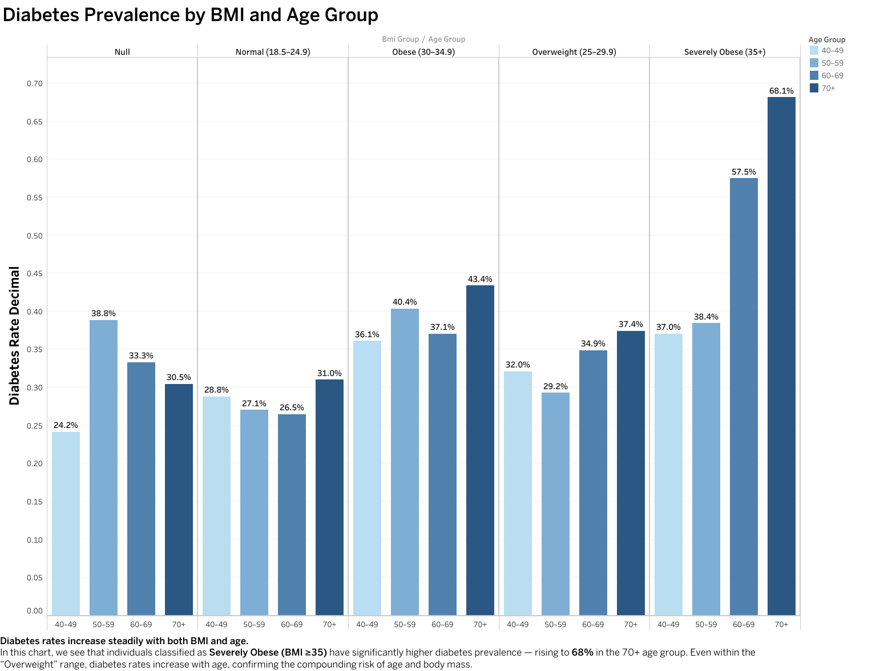
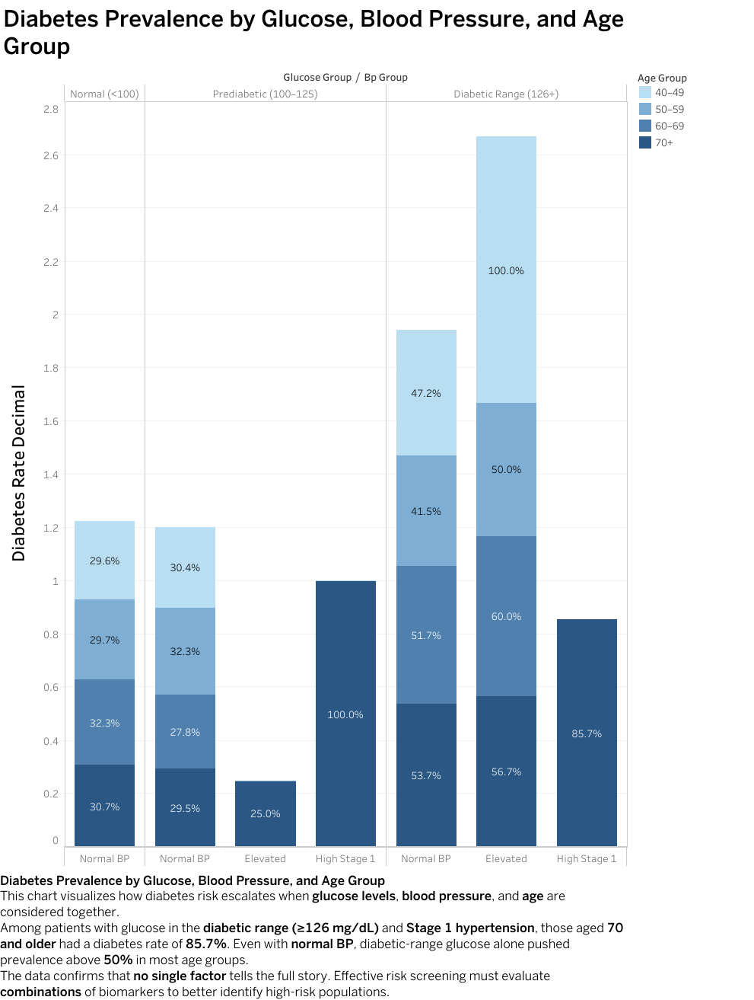

# Understanding Diabetes Risk Through Multi-Factor Analysis

## Project Background

This project analyzes a healthcare dataset containing patient demographic and clinical measurements to better understand the key factors associated with diabetes risk.

The objective is to identify patterns and relationships between variables such as glucose, BMI, age, and blood pressure, and determine which factors most strongly contribute to diabetes outcomes.

**Key Metrics:** Diabetes Outcome (0/1), Glucose, BMI, Age, Blood Pressure  
**Key Dimensions:** Patient demographics, clinical measurements, and health indicators

## Executive Summary

This analysis examines health and demographic data to identify key factors associated with diabetes risk.

Key findings:
- Glucose levels are the strongest indicator of diabetes risk  
- BMI and age show clear positive relationships with increased risk  
- Certain combinations of risk factors significantly increase likelihood of diabetes  
- Some variables (e.g., blood pressure) show weaker or inconsistent relationships  

These insights highlight opportunities for earlier identification of high-risk individuals and more targeted prevention strategies.

## Data Structure (ERD)

## Insights Deep-Dive

### Glucose Impact

** Insight:** Glucose levels are the strongest predictor of diabetes risk, with significantly higher values observed in positive cases.

* Diabetes prevalence rises sharply once glucose levels enter the **diabetic range (≥126 mg/dL)**, making glucose the **strongest standalone predictor** of diagnosis across all age groups.

* Within this range, prevalence increases from approximately **48% in adults aged 40–49** to **over 50% among patients aged 70+**, demonstrating that **age compounds metabolic risk even when glucose levels are already elevated**.

* Importantly, the upward age-related trend persists even among individuals with **normal or prediabetic glucose levels**, indicating that **baseline diabetes susceptibility increases with age independent of glucose classification**.

* These findings reinforce glucose testing as the **most critical early screening signal**, while also highlighting the need for **age-adjusted preventive monitoring** in older populations.

### BMI & Obesity

** Insight:** Higher BMI is strongly associated with increased diabetes risk, indicating obesity as a key contributing factor.

* Diabetes prevalence increases progressively across **BMI categories**, demonstrating a clear dose-response relationship between body mass and metabolic disease risk.

* Individuals classified as **Severely Obese (BMI ≥35)** exhibit the highest prevalence across all age groups, with rates approaching **68% among adults aged 70 and older**. This represents one of the strongest standalone risk signals identified in the analysis.

* Importantly, elevated BMI raises diabetes likelihood even in **younger populations**, indicating that excess body mass functions as a **long-term metabolic stressor rather than an age-dependent trigger**. As age increases, this baseline risk compounds further, producing sharply higher prevalence in older obese cohorts.

* These findings highlight BMI as a **critical preventive-care screening dimension** and support early **weight-management and metabolic monitoring interventions** to reduce long-term diabetes burden.

### Age Trends

** Insight:** Diabetes risk increases with age, with higher prevalence observed in older populations.

* Diabetes prevalence increases progressively across **BMI categories**, demonstrating a clear dose-response relationship between body mass and metabolic disease risk.

* Individuals classified as **Severely Obese (BMI ≥35)** exhibit the highest prevalence across all age groups, with rates approaching **68% among adults aged 70 and older**. This represents one of the strongest standalone risk signals identified in the analysis.

* Importantly, elevated BMI raises diabetes likelihood even in **younger populations**, indicating that excess body mass functions as a **long-term metabolic stressor rather than an age-dependent trigger**. As age increases, this baseline risk compounds further, producing sharply higher prevalence in older obese cohorts.

* These findings highlight BMI as a **critical preventive-care screening dimension** and support early **weight-management and metabolic monitoring interventions** to reduce long-term diabetes burden.

### Blood Pressure

**Insight:** Blood pressure shows a weaker and less consistent relationship with diabetes risk.

* When glucose level, blood pressure, and age are evaluated together, diabetes prevalence rises dramatically—demonstrating that multi-factor interaction, rather than any single biomarker, drives the most clinically significant risk.

* Among patients with diabetic-range glucose (≥126 mg/dL) and Stage-1 hypertension, adults aged 70 and older exhibit diabetes prevalence approaching 85–90%, representing the highest-risk cohort identified in the analysis. Even in the presence of normal blood pressure, diabetic-range glucose alone pushes prevalence above 50% across most age groups, confirming glucose as the dominant baseline driver while highlighting the amplifying effect of hypertension and aging.

* These findings reinforce the need for integrated risk-screening frameworks that evaluate combinations of metabolic indicators, enabling earlier identification of high-risk patients, more targeted preventive intervention, and improved allocation of clinical resources within population-health programs.

Highest diabetes prevalence occurs in older adults with diabetic glucose and Stage-1 hypertension.  
 

## Recommendations

### Healthcare Providers
- Prioritize glucose monitoring as a primary screening tool  
- Use combined risk factors (BMI, age, glucose) for early detection  

### Preventive Care Teams
- Develop targeted intervention programs for high-BMI populations  
- Promote lifestyle changes to reduce obesity-related risk  

### Data & Analytics Teams
- Build predictive models using key variables to identify high-risk patients  
- Improve data collection for additional risk factors  

### Public Health Initiatives
- Focus awareness campaigns on high-risk demographics  
- Encourage early screening and preventive care

### Key Takeaways

- Glucose is the strongest indicator of diabetes risk  
- BMI and age significantly contribute to increased risk  
- Early detection using combined factors can improve outcomes  

**View Dashboard:**
https://public.tableau.com/app/profile/noemi.vargas7800/viz/UnderstandingDiabetesRisk/DiabetesRiskAnalysis?publish=yes

## Assumptions & Caveats

- Dataset may not represent all populations equally  
- Some variables may contain missing or inconsistent values  
- Analysis shows correlation, not causation
- Cross-sectional snapshot rather than longitudinal tracking

Despite these limitations, the analysis demonstrates **real-world healthcare analytics methodology and decision-support thinking**.

## Tools & Methods

- **SQL:** joins, aggregations, KPI analysis  
- **Tableau:** executive dashboard design and visualization  
- **Data Modeling:** relational schema with ERD validation  
- **Dataset:** Public anonymized diabetes health dataset (~9,500 patients)

## Repository Contents

* [noemile8240/ Understanding_Diabetes/01_data/ — Raw and cleaned datasets used for analysis](01_data)
  
* [noemile8240/ Understanding_Diabetes/02_SQL_queries/ Data cleaning, exploration, and risk analysis SQL ](02_SQL_queries)
  
* [noemile8240/ Understanding_Diabetes /03_images/ — Visual outputs used in README storytelling](03_images)

* [noemile8240/ Understanding_Diabetes /04_project_docs — Technical notes, methodology, assumptions, process](04_project_docs)
 
* [noemile8240/ README.md — Executive case study and business insights](README.md)

